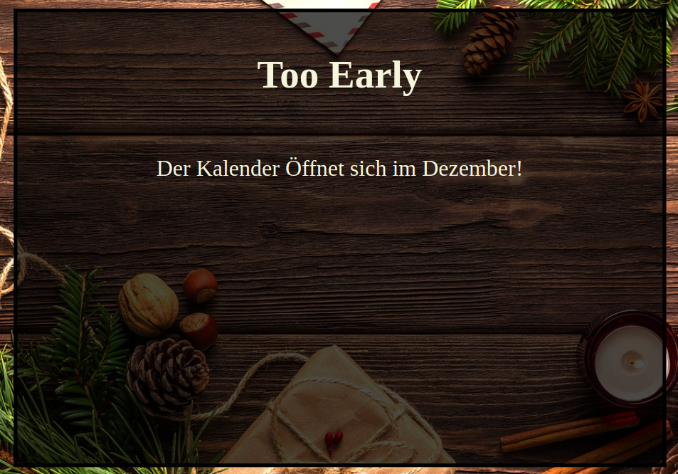
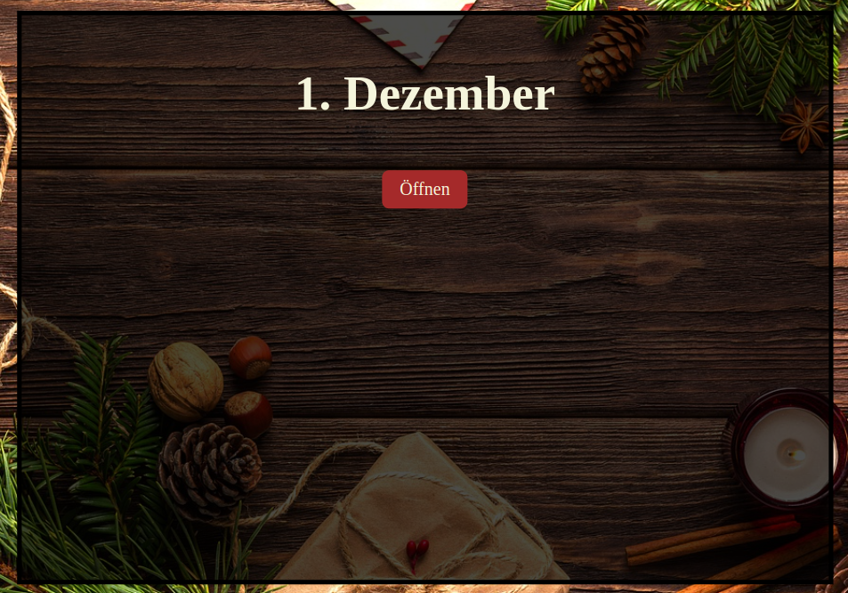
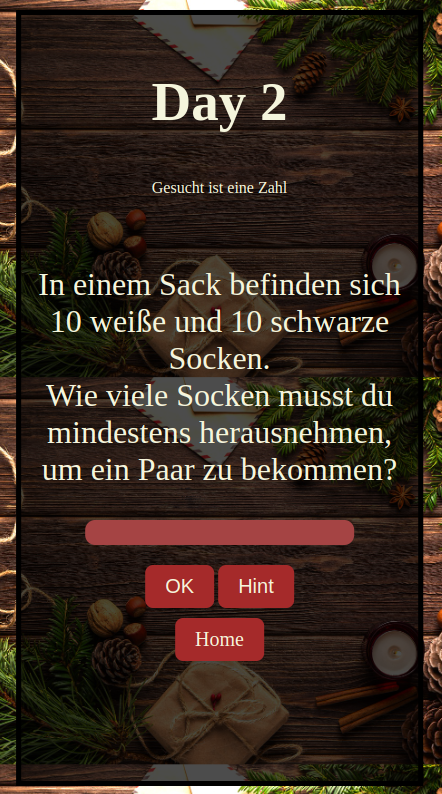
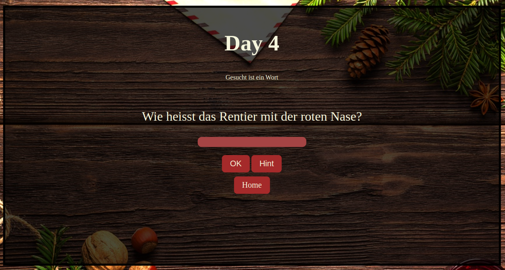

# advent-calendar
This small advent calendar started as an idea to provide my wife a little challenge every day before she get her present/candy of the day.

# Table of Contents
1. [Basics - look and feel](#basics---look-and-feel)   
1.1. [The basic build](#the-basic-build)   
1.2. [The question](#the-questions)
2. [The technical par](#the-technical-part)
3. [What is the Key used for?](#what-is-the-key-used-for)
4. [Future plans](#future-plans)

# Basics - look and feel

## The basic build
As is have more ideas to grow and implement in the future, this section describe what is currently availabe.    
There are currently two options that you will see when opening the webserver in a browser:

1. The page that states that it will open in december if the current date is not between 1. and 24. of december.


2. The page display the current Day and provide a button to open the calendar for the current day.


By clicking on the open button you will be redirected to the page showing the question of the day.

1. Mobile view      


2. Desktop view    


The task is now to provide the correct answer. There is also a button for a hint. This might be not always perfectly helpful, depending on the question.    


## The questions
Currently there are tree types of question ask during the calendar:
1. Number - provide the correct number as the correct answer
2. Word - provide the correct word as the correct answer
3. Multi - there are at least 3 different answers, choose the correct one

All questions are hardcoded for now and just diplayed for the current day they belong to. This could be changes in the future.

# The technical part

## The webserver
For the webserver i use nodejs with an express and ejs module.

## The config
The configuration is ```json``` based and provided inside the ```config/conf.json``` file.   
The configuration exists for everyday with the following keys:   
| Key  |  Description | type  | Example |
|---|---|---|---|
|  day |  current day  |  int  |  "day": 1,  |
|  type |  question type (number, word, multi)  |  string  |  "type": "number"  |
|  title |  title for the day page (currently same as the day)  |  string  |  "title": "1"  |
|  question |  text of the question  |  string  |  "question": "1 + 1 = ?"  |
|  hint |  small hint for the answer  |  string  |  "hint": "its not 1"  |
|  answer |  the correct answer  |  string/int/array  |  "answer": 2  |
|  answerDesc |  an explanation for the correct answer  |  string  |  "answerDesc": " 1 + 1 = 2 "  |
|  key |  the 4 digit key for the lock  |  string  |  "key":"1289"  |

How the real implementation look like and the different types are set up can be found in the configuration file ```config/conf.json``` 

## The server
Raspberry Pi 3b in my local network

# What is the key used for
As my first idea for this calendar was to have a box that is locked by an internal closure (controlled by a servo or other type of actuator).    
On top of the box there will be a QR-code leading to this webserver. When finishing the daily challenge the actuator inside the box will open the lock. Due to time limits this feature is shifted to future plans.

Currently providing the correct answer will give an 4 digit key. With this key my wife can unlock the lock on the box to get the daily reward.

For the lock i used a basic 4 digit lock from amazon and a latch for closing it.

# Future plans

## remote controlled box
Providing the correct answer will open the lock on the adventcalendar remotely.